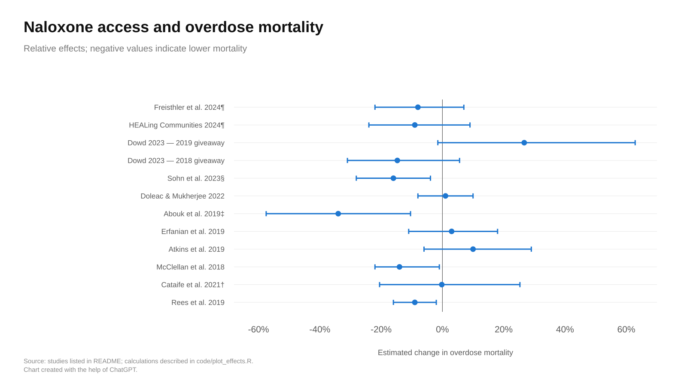
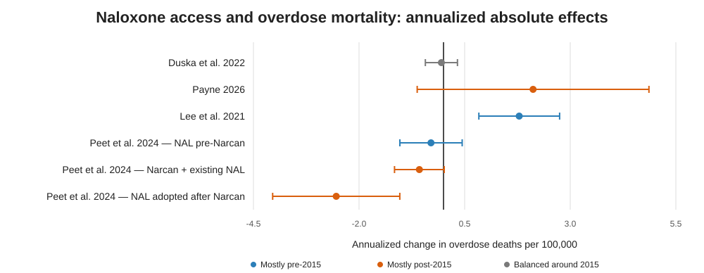

# Naloxone access and overdose mortality evidence review

***This text and repository were written by OpenAI's ChatGPT.***

This repository contains a working evidence table, figures, and R code for experimental and quasi-experimental studies estimating the effect of naloxone access or distribution on overdose mortality.

The starting point was Khezri et al. (2026), *Illicit drug supply, naloxone availability, and overdose mortality in the fentanyl era: a systematic review* ([Health Affairs Scholar](https://academic.oup.com/healthaffairsscholar/article/4/4/qxag074/8544909)). Additional quasi-experimental papers were added when they appeared to satisfy the working inclusion criteria.

## Selection process

The study set was built iteratively:

1. Extract experimental and quasi-experimental mortality studies from the Health Affairs Scholar review.
2. Exclude uncontrolled interrupted-time-series analyses and other designs without a sufficiently strong counterfactual.
3. For interrupted-time-series / controlled interrupted-time-series studies, require unit fixed effects or an equivalent design-based control structure for inclusion in the main analyses.
4. Add quasi-experimental studies outside the review, including Rees et al. (2019), Atkins et al. (2019), Erfanian et al. (2019), Duska et al. (2022), Peet et al. (2024), and Payne (2026).
5. Move Walley et al. (2013), Toce et al. (2024), Xuan et al. (2024), and Newman et al. (2025) to an appendix because their ITS/CITS specifications did not meet that control criterion.
6. Focus the final figures on overdose mortality rather than ED visits or hospitalizations.

This is a working review rather than a formal meta-analysis. The rows are not statistically pooled, and multiple estimates from the same study/trial are displayed separately when substantively useful.

## Effect-scale decisions

Studies report mortality effects on incompatible scales, so the results are shown in two figures.

### Relative effects

Risk ratios, rate ratios, and estimates that could be represented on a percent-change scale are shown as percentage changes in overdose mortality. Negative values indicate lower mortality.



### Absolute effects

Absolute rate differences are placed on a common annualized scale: deaths per 100,000 per year. Annual estimates are left unchanged; quarterly estimates are multiplied by 4. Monthly estimates would be multiplied by 12, although the final included set contains no monthly estimate after Newman was excluded.



## Study table

| Study | Design | Effect scale | Estimate | 95% CI | Notes | Study |
|---|---|---|---:|---:|---|---|
| Rees et al. 2019 | DID / controlled pre-post | Relative (%) | -9.0% | -16.0% to -2.0% | State naloxone access laws. | [link](https://chicagounbound.uchicago.edu/jle/vol62/iss1/1/) |
| Cataife et al. 2021† | Matched staggered DID | Relative (%) | -0.2% | -20.5% to 25.3% | Homogeneous nationwide model used for scalar display; authors prefer a heterogeneous dynamic specification. | [link](https://pubmed.ncbi.nlm.nih.gov/31951788/) |
| McClellan et al. 2018 | DID | Relative (%) | -14.0% | -22.0% to -1.0% | State naloxone access laws. | [link](https://pubmed.ncbi.nlm.nih.gov/29610001/) |
| Atkins et al. 2019 | Controlled pre-post | Relative (%) | 10.0% | -6.0% to 29.0% | NAL estimate is secondary to the paper's Good Samaritan-law analysis. | [link](https://pmc.ncbi.nlm.nih.gov/articles/PMC6407344/) |
| Erfanian et al. 2019 | Spatial quasi-experimental model | Relative (%) | 3.0% | -11.0% to 18.0% | Spatial quasi-experimental specification; less directly comparable to standard DID estimates. | [link](https://rrs.scholasticahq.com/article/7932-the-impact-of-naloxone-access-laws-on-opioid-overdose-deaths-in-the-u-s) |
| Abouk et al. 2019‡ | DID / event study | Relative (%) | -34.0% | -57.5% to -10.4% | Direct-pharmacist-authority estimate; percentage CI derived from reported absolute CI and comparison mean. | [link](https://pmc.ncbi.nlm.nih.gov/articles/PMC6503576/) |
| Doleac & Mukherjee 2022 | DID / panel FE | Relative (%) | 1.0% | -8.0% to 10.0% | Numeric RR comes from the study version summarized in Smart et al.; final publication reports no measurable mortality reduction. | [link](https://www.journals.uchicago.edu/doi/10.1086/719588) |
| Sohn et al. 2023§ | DID | Relative (%) | -16.0% | -28.1% to -3.9% | Prescription/treatment-opioid mortality; percentage CI derived from reported absolute CI. | [link](https://www.sciencedirect.com/science/article/abs/pii/S0749379722005281) |
| Dowd 2023 — 2018 giveaway | DID / event study | Relative (%) | -14.7% | -31.0% to 5.6% | First Pennsylvania naloxone giveaway. | [link](https://onlinelibrary.wiley.com/doi/full/10.1002/hec.4755) |
| Dowd 2023 — 2019 giveaway | DID / event study | Relative (%) | 26.7% | -1.5% to 62.9% | Second Pennsylvania naloxone giveaway. | [link](https://onlinelibrary.wiley.com/doi/full/10.1002/hec.4755) |
| HEALing Communities 2024¶ | Cluster randomized trial | Relative (%) | -9.0% | -24.0% to 9.0% | Multicomponent cluster RCT; same underlying trial as Freisthler et al. | [link](https://www.nejm.org/doi/full/10.1056/NEJMoa2401177) |
| Freisthler et al. 2024¶ | Cluster randomized trial, secondary analysis | Relative (%) | -8.0% | -22.0% to 7.0% | Secondary analysis of the same multicomponent cluster RCT as HEALing Communities. | [link](https://jamanetwork.com/journals/jamanetworkopen/fullarticle/2825142) |
| Duska et al. 2022 | Synthetic control | Annualized deaths / 100k / year | -0.05 | -0.43 to 0.33 | Synthetic-control estimate; already annual. | [link](https://journals.sagepub.com/doi/10.1177/20503245221112575) |
| Payne 2026 | Staggered county DID | Annualized deaths / 100k / year | 2.12 | -0.62 to 4.86 | Preferred adjusted full-sample estimate; 95% CI computed as estimate ± 1.96×SE. | [link](https://papers.ssrn.com/sol3/papers.cfm?abstract_id=7279243) |
| Lee et al. 2021 | Panel-matching DID | Annualized deaths / 100k / year | 1.79 | 0.84 to 2.75 | Absolute quarterly estimate annualized by multiplying by 4. | [link](https://jamanetwork.com/journals/jamanetworkopen/fullarticle/2776301) |
| Peet et al. 2024 — NAL pre-Narcan | Imputation DID | Annualized deaths / 100k / year | -0.30 | -1.03 to 0.44 | Table 3 +LASSO estimate; quarterly effect annualized ×4; 2010–2015 experiment. | [link](https://www.nber.org/papers/w33105) |
| Peet et al. 2024 — Narcan + existing NAL | Imputation DID | Annualized deaths / 100k / year | -0.57 | -1.16 to 0.02 | Table 3 +LASSO estimate; quarterly effect annualized ×4; 2016–2019 experiment. | [link](https://www.nber.org/papers/w33105) |
| Peet et al. 2024 — NAL adopted after Narcan | Imputation DID | Annualized deaths / 100k / year | -2.54 | -4.05 to -1.03 | Table 3 +LASSO estimate; quarterly effect annualized ×4; 2016–2019 experiment. | [link](https://www.nber.org/papers/w33105) |

## Important coding notes

- **Cataife et al. (2021):** the plotted scalar is the homogeneous nationwide model. The authors prefer a dynamic specification with region/year heterogeneity and caution against treating a single average treatment effect as universally meaningful.
- **Abouk et al. (2019):** the displayed percent effect uses the paper's longer-run direct-pharmacist-authority estimate. The percentage CI is derived from the absolute CI using the reported comparison mean.
- **Doleac & Mukherjee (2022):** the numeric RR displayed here comes from the study version synthesized in Smart et al. (2021); the final publication supports the qualitative null-mortality conclusion.
- **Sohn et al. (2023):** the plotted percentage CI is derived from the reported absolute CI and the paper's stated 16% effect magnitude.
- **Dowd (2023):** the two Pennsylvania giveaways are shown separately because the paper reports opposite-signed event-specific estimates; the pooled analysis is not statistically significant.
- **HEALing Communities / Freisthler (2024):** these are two publications from the same cluster-randomized trial, not independent experiments. The intervention included naloxone distribution, medications for opioid use disorder, and safer opioid prescribing, so it does not identify a naloxone-only effect.
- **Payne (2026):** the preferred adjusted full-sample mortality coefficient is +2.12 opioid-related deaths per 100,000 per year (SE 1.40). The CI in the data/plot is computed as ±1.96 SE.
- **Peet et al. (2024):** the three plotted absolute estimates use the +LASSO specification in Table 3. Quarterly coefficients and confidence intervals are multiplied by 4 for the annualized figure.
- **Lee et al. (2021):** the reported absolute estimate is converted from the paper's population normalization to deaths per 100,000 and then annualized from quarterly to yearly units.

## Appendix

Interrupted-time-series and controlled interrupted-time-series studies that were considered but excluded from the main analyses under the stricter control criterion are listed in [`appendix/excluded_its.md`](appendix/excluded_its.md). The underlying table is also available as [`data/excluded_its.csv`](data/excluded_its.csv).

## Repository contents

- `data/effects.csv` — final plotted estimates and study URLs.
- `data/excluded_its.csv` — ITS/CITS studies excluded from the main analyses under the control criterion.
- `appendix/excluded_its.md` — appendix table with exclusion reasons and reported mortality results.
- `code/plot_effects.R` — R code that defines the plotted data, applies the CF house style, and regenerates both figures.
- `figures/relative_effects.svg` — relative-effect forest plot.
- `figures/annualized_absolute_effects.svg` — annualized absolute-effect forest plot.

## Reproducing the figures

The R script requires `dplyr`, `ggplot2`, `readr`, `scales`, and `ragg`. From the repository root:

```r
source("code/plot_effects.R")
```

The R script regenerates PNG and SVG versions of the figures under `figures/` and writes a reproduced copy of the plotted data to `data/effects_reproduced.csv`.
